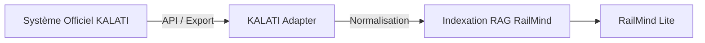

# Rapport de Conception Détaillée : RailMind Lite

## 1. Introduction
Ce rapport présente la conception détaillée de la solution **RailMind Lite**, notre système de Recherche Documentaire Augmentée (RDA) conçu pour le Programme Innovation Ferroviaire de CAMRAIL. 

L'objectif est d'offrir une interface intelligente capable de répondre aux questions du personnel en se basant strictement sur les référentiels internes (manuels, notes de service, règles de sécurité) tout en garantissant une étanchéité absolue des droits d'accès.

## 2. Matrice des Fonctionnalités

La matrice ci-dessous établit la correspondance exacte entre les exigences du cahier des charges CAMRAIL et l'état actuel de RailMind Lite :

| Exigence CAMRAIL | Fonctionnalité RailMind Lite | Preuve Technique | État |
| :--- | :--- | :--- | :--- |
| IA conversationnelle | Assistant conversationnel (Chat) | Interface Next.js avec historique | ✅ |
| Recherche documentaire | Recherche hybride | `hybrid_search` dans `retrieval.py` | ✅ |
| Recherche sémantique | Embeddings + pgvector | Base PostgreSQL + `all-MiniLM-L6-v2` | ✅ |
| Recherche lexicale | Indexation PostgreSQL tsvector | Filtre `to_tsquery('french')` | ✅ |
| Génération de réponses | Modèle LLM (Gemini Lite/Ollama) | Route `/assistant/query` | ✅ |
| Sources des réponses | Citations cliquables | Dédoublonnage via `document_id` et `page` | ✅ |
| Groupes de sécurité | Security Groups | Schéma `security_groups` | ✅ |
| Gestion des profils | Rôles (Admin, DocAdmin, ReadOnly) | JWT Token + Middlewares | ✅ |
| Protection des données | Traitement maîtrisé | Données cloisonnées en base | ✅ |
| Historique | Historique des conversations | Tables `conversations` conservées | ✅ |
| Mobile | Interface responsive | Conception Tailwind CSS | ✅ |
| Connexion KALATI | Architecture prévue (Adapter) | API ouverte pour connecteur futur | 🟡 |
| Audit et traçabilité | Audit events (Journal d'activité) | Table `audit_events` | ✅ |
| Formation utilisateurs | Manuels et modules documentés | Pack documentaire inclus | ✅ |
| Multimodal | (Hors périmètre actuel) | - | ❌ |
| Voix | (Hors périmètre actuel) | - | ❌ |

## 3. Gestion des utilisateurs et des droits

L'accès à l'information est strictement contrôlé selon l'architecture suivante :

```mermaid
flowchart TD
    A[Utilisateur connecté] --> B{Profil}
    B -->|Admin / DocAdmin| C[Accès global ou de gestion]
    B -->|Read Only| D[Filtrage par Département]
    D --> E[Filtrage par Groupes de Sécurité]
    E --> F[Documents autorisés (Corpus restreint)]
    F --> G[Recherche RAG]
```

### Profils
- **Admin :** Accès global à l'application, au tableau de bord complet et à la recherche sans restriction documentaire.
- **Document Admin :** Gestion experte du cycle de vie des documents (Ajout, indexation, désactivation) et accès global à la recherche.
- **Read Only :** Employé standard. Accès limité **exclusivement** aux documents de son département et aux groupes de sécurité dont il est membre.

## 4. Fonctionnement de la Recherche Augmentée (RAG)

RailMind Lite utilise une approche avancée pour garantir que l'IA ne génère jamais d'information fausse (hallucination). Voici le flux de traitement lorsqu'une question est posée :

1. **La Requête :** L'utilisateur pose une question.
2. **Filtrage de Sécurité :** Le backend identifie l'utilisateur via son jeton JWT et construit une requête SQL qui exclut d'emblée tous les documents inactifs ou hors de ses droits d'accès.
3. **Recherche Hybride :**
   - *Recherche Sémantique :* La question est transformée en vecteur mathématique. Le système cherche les paragraphes (chunks) dont le sens est le plus proche (Distance Cosinus via `pgvector`).
   - *Recherche Lexicale :* Le système cherche l'occurrence exacte des mots-clés dans la base PostgreSQL (`ts_rank`).
4. **Extraction :** Les meilleurs extraits sont sélectionnés.
5. **Génération LLM :** Le modèle (Gemini Flash Lite ou Ollama local) reçoit les extraits et la consigne stricte : *"N'invente jamais une politique, un seuil ou une date qui n'apparaît pas explicitement dans les extraits"*.
6. **Réponse et Citations :** L'IA formule la réponse. Si l'information n'est pas trouvée, le système s'abstient volontairement avec un niveau de confiance "Information insuffisante". Les sources ayant servi à la réponse sont affichées de manière unique et cliquable.

## 5. Gestion Documentaire et Déduplication

Le cycle de vie d'un document est rigoureusement contrôlé :
1. **Téléversement :** Le fichier PDF est envoyé au serveur.
2. **Déduplication Stricte :** Le système calcule une **empreinte numérique unique (Hash SHA-256)** du contenu du fichier. Il ne se base pas uniquement sur le nom du fichier. Si l'empreinte existe déjà en base, l'upload est refusé (Statut : *Aucune nouvelle copie inutile*).
3. **Extraction & Chunks :** Le texte est extrait, nettoyé et découpé en paragraphes pertinents (chunks).
4. **Indexation :** Les embeddings sont générés et stockés (Statut : *indexed*).
5. **Activation :** L'administrateur valide le document (Statut : *active*).

## 6. Architecture Cible : Intégration KALATI

RailMind Lite est actuellement autonome avec sa propre base documentaire PostgreSQL. Cependant, pour répondre à l'exigence CAMRAIL, l'architecture prévoit l'ajout futur d'un **connecteur KALATI** (KALATI Adapter) :



Dès que CAMRAIL fournira les accès et spécifications techniques de KALATI, ce connecteur pourra importer les documents validés, leurs métadonnées et leurs groupes de sécurité officiels vers le moteur RAG de RailMind, sans remettre en cause la structure actuelle.

## 7. Cybersécurité et Audit (Traçabilité)

La sécurité est une priorité absolue :
- **Authentification SSO (Active Directory) :** L'application est prête à intégrer l'authentification Microsoft (OAuth2/OIDC) afin que les employés se connectent avec leurs identifiants d'ordinateur, sans gestion de mot de passe supplémentaire.
- **Séparation Frontend/Backend :** L'architecture API-first garantit que la logique métier et les secrets (clés d'API) ne sont jamais exposés côté client.
- **Traçabilité Totale (Audit) :** La table `audit_events` enregistre chaque action.

Flux d'audit :
`Utilisateur authentifié` → `Requête / Upload / Suppression` → `Enregistrement en base (Date, Heure, ID Utilisateur, Action, Détails)`.
Ces traces sont directement consultables par les administrateurs depuis le tableau de bord (Activité 24h).
